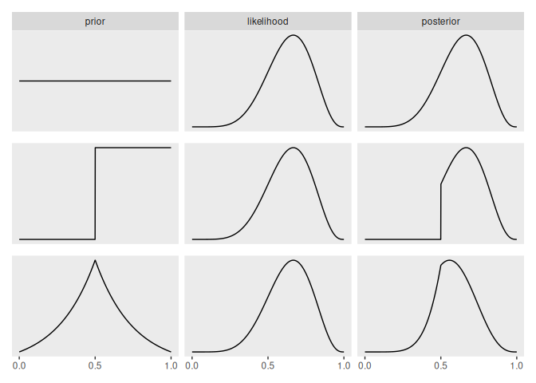
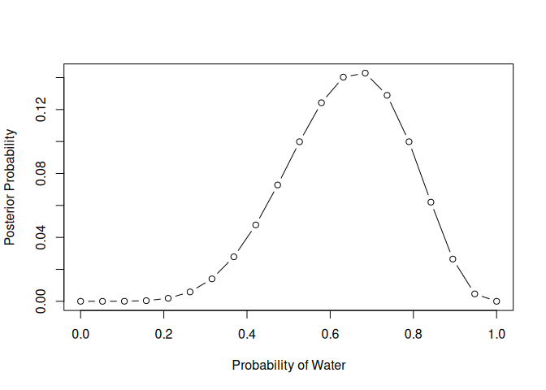
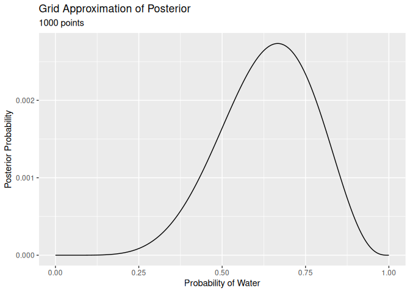

# INTERACT-2

For most of this chapter, we are using the globe tossing example used
extensively in the beginning of the book. In this situation, we have
tossed the globe 9 times and have landed on “W” 6 times.

## Making the Model Go

Reconstructing Figure 2.6 from the textbook using tidyverse code. We
will do this via grid approximation, described in more detail in the
next section.

<details>
<summary>Code</summary>

``` r
sequence_length <- 1e3

d <-
  tibble(probability = seq(from = 0, to = 1, length.out = sequence_length)) %>%
  expand_grid(row = c("flat", "stepped", "Laplace")) %>%
  arrange(row, probability) %>%
  mutate(
    prior = ifelse(row == "flat", 1,
      ifelse(row == "stepped", rep(0:1, each = sequence_length / 2),
        exp(-abs(probability - 0.5) / .25) / (2 * 0.25)
      )
    ),
    likelihood = dbinom(x = 6, size = 9, prob = probability)
  ) %>%
  group_by(row) %>%
  mutate(posterior = prior * likelihood / sum(prior * likelihood)) %>%
  pivot_longer(prior:posterior) %>%
  ungroup() %>%
  mutate(
    name = factor(name, levels = c("prior", "likelihood", "posterior")),
    row = factor(row, levels = c("flat", "stepped", "Laplace"))
  )

p1 <-
  d %>%
  filter(row == "flat") %>%
  ggplot(aes(x = probability, y = value)) +
  geom_line() +
  scale_x_continuous(NULL, breaks = NULL) +
  scale_y_continuous(NULL, breaks = NULL) +
  theme(panel.grid = element_blank()) +
  facet_wrap(~name, scales = "free_y")


p2 <-
  d %>%
  filter(row == "stepped") %>%
  ggplot(aes(x = probability, y = value)) +
  geom_line() +
  scale_x_continuous(NULL, breaks = NULL) +
  scale_y_continuous(NULL, breaks = NULL) +
  theme(
    panel.grid = element_blank(),
    strip.background = element_blank(),
    strip.text = element_blank()
  ) +
  facet_wrap(~name, scales = "free_y")

p3 <-
  d %>%
  filter(row == "Laplace") %>%
  ggplot(aes(x = probability, y = value)) +
  geom_line() +
  scale_x_continuous(NULL, breaks = c(0, .5, 1)) +
  scale_y_continuous(NULL, breaks = NULL) +
  theme(
    panel.grid = element_blank(),
    strip.background = element_blank(),
    strip.text = element_blank()
  ) +
  facet_wrap(~name, scales = "free_y")

# combine
library(patchwork)
p1 / p2 / p3
```

</details>



### Grid Approximation

This technique breaks up the posterior distribution into a finite set of
discrete parameters, and estimates the posterior probability at each
discrete value by multiplying the prior probability by the likelihood.

This isn’t a practical method for most issues, but will help develop
intuition on how Bayesian inference works. The steps are as follows:

- Define the grid by deciding on how many points to use in estimating
  the posterior probability, then plot these parameter values on the
  grid
- Define the value of the prior probability at each point on the grid
- Calculate the likelihood at each point on the grid
- Compute the unstandardize posterior probability at each value on the
  grid by multiplying the prior and likelihood
- Standardize the posterior probability by dividing each value by the
  sum of all values

This is how this would work with the globe tossing example, assuming
that there were nine tosses with 6 turning up W.

**McElreath Base R Version**

<details>
<summary>Code</summary>

``` r
# Define grid
p_grid <- seq(from = 0, to = 1, length.out = 20)

# Define prior at each point on the grid
prior <- rep(1, 20)

# Calculate the likelihood at each point on the grid
likelihood <- dbinom(6, size = 9, prob = p_grid)

# Compute unstandardized posterior
unstd_posterior <- likelihood * prior

# Standardize posterior
std_posterior <- unstd_posterior / sum(unstd_posterior)

plot(p_grid, std_posterior,
  type = "b",
  xlab = "Probability of Water", ylab = "Posterior Probability"
)
```

</details>



**Tidyverse Version**

<details>
<summary>Code</summary>

``` r
d <- tibble(
  probability = seq(from = 0, to = 1, length.out = 20),
  prior = 1
) |>
  mutate(likelihood = dbinom(6, size = 9, prob = probability)) |>
  mutate(unstd.posterior = prior * likelihood) |>
  mutate(std.posterior = unstd.posterior / sum(unstd.posterior))

d1000 <- tibble(
  probability = seq(from = 0, to = 1, length.out = 1000),
  prior = 1
) |>
  mutate(likelihood = dbinom(6, size = 9, prob = probability)) |>
  mutate(unstd.posterior = prior * likelihood) |>
  mutate(std.posterior = unstd.posterior / sum(unstd.posterior))

d.plot.20 <- d |>
  ggplot(aes(x = probability, y = std.posterior)) +
  geom_point() +
  geom_line() +
  labs(
    title = "Grid Approximation of Posterior",
    subtitle = "20 points",
    x = "Probability of Water",
    y = "Posterior Probability"
  )

d.plot.1000 <- d1000 |>
  ggplot(aes(x = probability, y = std.posterior)) +
  # geom_point() +
  geom_line() +
  labs(
    title = "Grid Approximation of Posterior",
    subtitle = "1000 points",
    x = "Probability of Water",
    y = "Posterior Probability"
  )

d.plot.20
```

</details>


<details>
<summary>Code</summary>

``` r
d.plot.1000
```

</details>



### Quadratic Approximation

<details>
<summary>Code</summary>

``` r
globe.qa <- quap(
  alist(
    W ~ dbinom(W + L, p),
    p ~ dunif(0, 1)
  ),
  data = list(W = 6, L = 3)
)

# display summary of quadratic approximation
precis(globe.qa)
```

</details>

           mean        sd      5.5%     94.5%
    p 0.6666663 0.1571339 0.4155361 0.9177966
